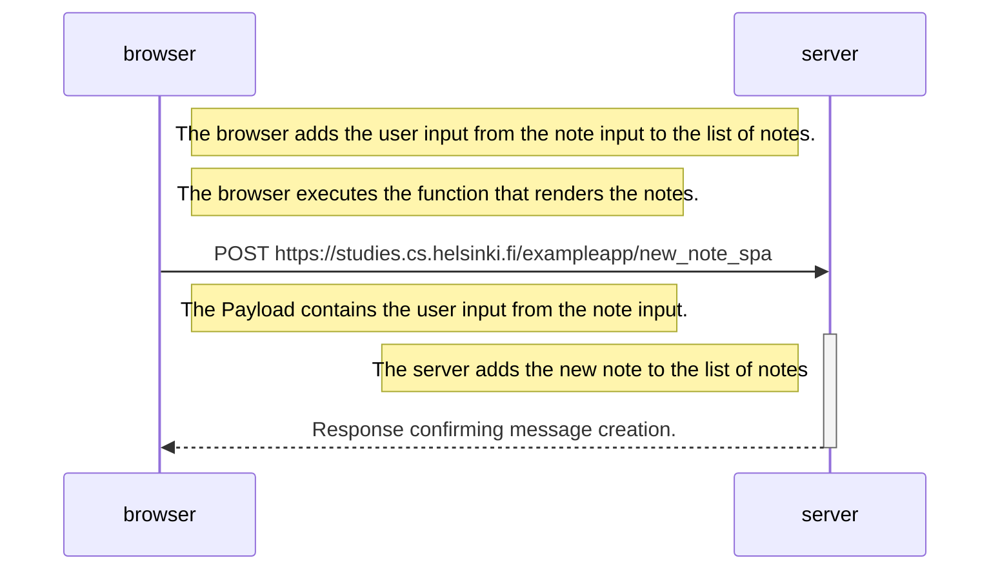

```mermaid
sequenceDiagram
participant browser
participant server

    Note right of browser: The browser adds the user input from the note input to the list of notes.
    Note right of browser: The browser executes the function that renders the notes.

    browser->>server: POST https://studies.cs.helsinki.fi/exampleapp/new_note_spa

    Note right of browser: The Payload contains the user input from the note input.

    activate server
    Note left of server: The server adds the new note to the list of notes
    server-->>browser: Response confirming message creation.
    deactivate server

```
